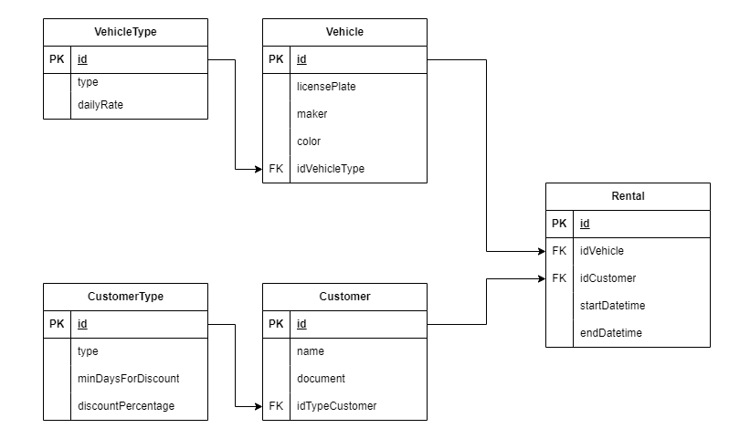

# Projeto POO II - LocateCar 

## Objetivo
Implementar uma aplicação com menu iterativo no console que gerencia o aluguel de veículos, desde cadastro de veículos e clientes até ações como alugar e devolver um veículo alugado. Uma aplicação que seria utilizada numa locadora de veículos.
Sempre visando a aplicação os conceitos vistos no módulo, como uso de Generics, Interface e os princípios do SOLID.

## Modelo de dados

O diagrama de modelo de dados do projeto serviu para guiar na criação das classes de domínio (*domain*) e mostrar a relação que existe entre essas classes.

## Funcionalidades

### 1. Cadastro de cliente
Permite o registro de informações básicas dos clientes, incluindo o nome e o documento (CPF para pessoa física e CNPJ para pessoa jurídica).

### 2. Cadastro de veículo
Permite o registro de informações básicas dos veículos, incluindo o tipo (pequeno, médio e SUV), a placa, o fabricante, o ano de fabricação e a disponibilidade.

### 3. Alteração no cadastro de cliente
Permite a atualização de informações dos clientes.

### 4. Alteração no cadastro de veículo
Assim como o item anterior, permite a atualização de informação dos veículos.

### 5. Busca de um veículo
Possibilita procurar um veículo passando apenas uma subparte da placa. Nesse caso, a busca retorna todos os veículos cuja placa contenha essa subparte.

### 6. Alugar um veículo
Realiza a ação de alugar um veículo disponível por um cliente. No ato é solicitado a data, o horário e o local que foi feita a ação.

### 7. Devolução de um veículo alugado
Realiza a devolução de um veículo alugado. No ato é solicitado a data, o horário e o local que foi feita a devolução. Assim, possibilita o cálculo do valor a ser pago baseando-se nas regras de negócio do projeto.

## Considerações
No início foi difícil de enxergar como poderia ser aplicado os princípios do SOLID no projeto. Mas ao longo do desenvolvimento e as dúvidas dos colegas nas aulas ajudaram a clarear um pouco. 

Foi bastante usado no projeto o príncípio de responsabilidade única (ou `Single Responsability Principle`). Apliquei nas classes de `service` e de `controller`, assim cada uma delas tem apenas uma responsabilidade atrelada, como a de cadastrar um `domain` e a de calcular a diária final do aluguel.

Também foi aplicado o princípio de segregação de interface (ou `Interface Segregation Principle`), no caso do projeto, foi criado apenas uma interface, a de `repository`. A interface foi proposta na aula, e havia a assinatura do método `delete`. Nesse caso, optei por tirar o método da interface ao invés de criar uma nova interface para ele, porque não seria implementado por nenhuma classe *filha* de repository.

Por ter aplicado o princípio de responsabilidade única nas classes de `controller`, acredito que o princípio da inversão da dependência (ou `Dependency Inversion Principle`) acabou sendo violado por uma classe de `controller` depender de várias classes de `service`.

Tive que ponderar sobre a utilização de exceções customizadas que ficaram de fora da implementação.
Como essas exceções seriam do tipo `RuntimeException`, optei por fazer as validações necessárias a fim de evitar a ocorrência delas. Por exemplo, verificar se uma instância é `null` antes de acessar algum atributo ou método.

Possíveis melhorias:
- Além de implementar os itens opcionais do projeto, que são:
    - paginar as listagens envolvidas
    - gravar os dados em arquivos
- Poderia refatorar o código para utilizar mais interface ou herança.